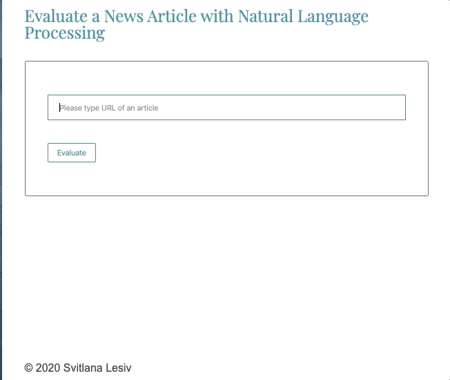

# Overview
This application evaluates a News Article with Natural Language Processing. After submission URL of an article, sentiments (from Aylien API) of the article will be displayed on the screen.

The goal of this project is to practice with:
- Webpack.
- Sass styles.
- Service workers.
- Using APIs and creating requests to external urls.

## Installation
- Clone the repository.
- Sign up for the `Aylien` API key, and use your keys in the code.
- `cd` into `evaluate-news-nlp` folder and run:
  - `yarn install`
  - `yarn build-dev` (to build development server) or `yarn build-prod` (production server)
  - `yarn start`

- open browser with http://localhost:8080/ to run the app in development mode.
- open browser with  http://localhost:8080/ to run the app in production mode.